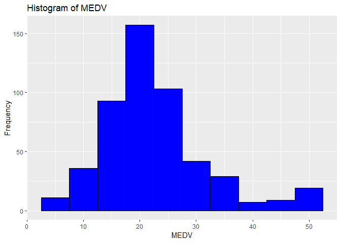
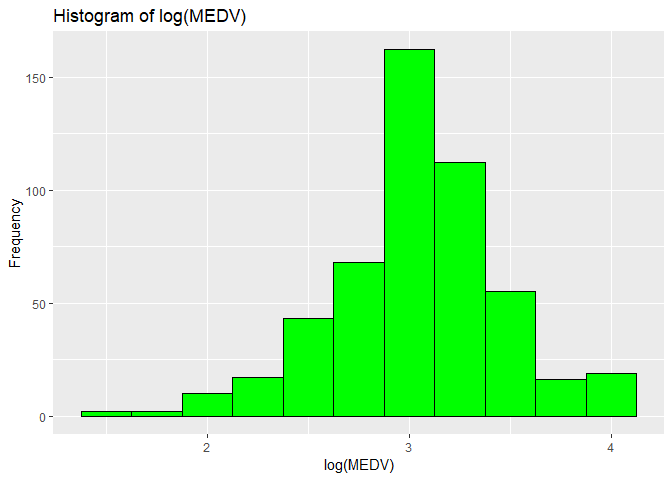
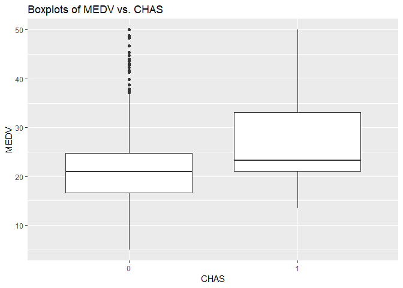
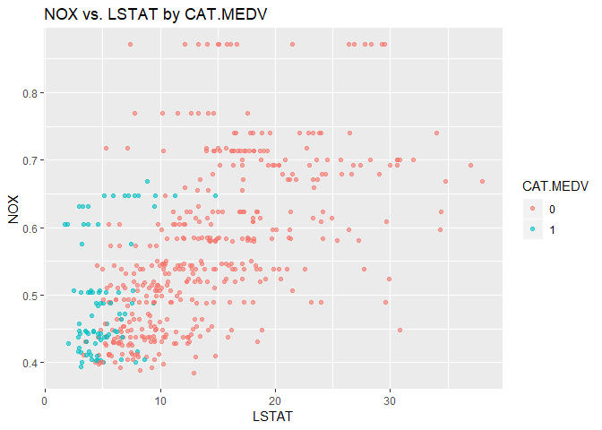
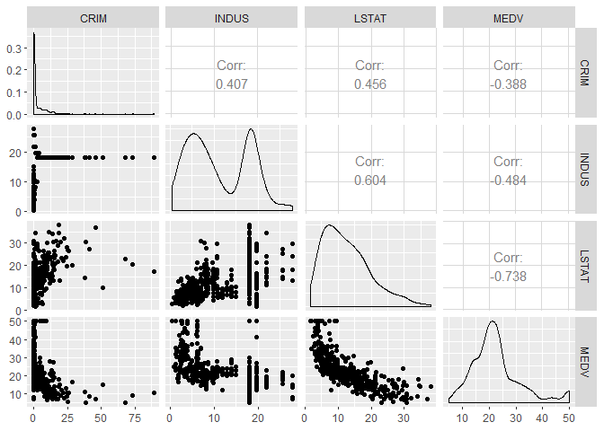

EDA for Boston Housing Data
================
Anne (Annie) Lott
January 27, 2019

``` r
#set working directory externally and read in the data
housing = read.csv("BostonHousing.csv", header = TRUE)

#check for presence of missing values
sum(is.na(housing))
```

    ## [1] 0

``` r
#no missing values

#load libraries
library(ggplot2)
library(GGally)

#######################
#######################
###                 ###
### Data Partioning ###
###                 ###
#######################
#######################

#set seed for constant partitions
set.seed(123)

#partitioning into training (50%), validation (30%),
#and testing (20%)

#randomly sample 50% of the row IDs for training
train = sample(rownames(housing), floor(nrow(housing)*0.5))

#sample 30% of the row IDs into the validation set, drawing only
#from the records not already in the training set
valid = sample(setdiff(rownames(housing), train),
               floor(nrow(housing)*0.3))

#assign the remaining 20% of row IDs to test
test = setdiff(rownames(housing), union(train, valid))

#create training, validation, and test data frames
housing.train = housing[train,]
housing.valid = housing[valid,]
housing.test = housing[test,]

#####################
#####################
###               ###
###     EDA       ###
###               ###
#####################
#####################

#examine how LSTAT affects MEDV in scatter plot
ggplot(housing) +
  geom_point(aes(x = LSTAT, y = MEDV), color = "navy", alpha = 0.7) +
  ggtitle("MEDV versus LSTAT")
```


``` r
#compute mean MEDV per CHAS = (0, 1)
medv.per.chas = aggregate(housing$MEDV, by = list(housing$CHAS),
                          FUN = mean)
names(medv.per.chas) = c("CHAS", "MeanMEDV")

#create bar plot of average median house value by CHAS
ggplot(medv.per.chas) + 
  geom_bar(aes(x = as.factor(CHAS), y = MeanMEDV), stat = "identity",
           fill = "blue") +
  labs(x = "Bounding Charles River", y = "Mean Median Housing Value")+
  ggtitle("MeanMEDV versus CHAS")
```


``` r
#compute % CAT.MEDV per CHAS = (0, 1)
percent.chas = aggregate(housing$CAT..MEDV, by = list(housing$CHAS),
                         FUN = mean)
names(percent.chas) = c("CHAS", "MeanCATMEDV")

#barchart of % CAT.MEDV versus CHAS
ggplot(percent.chas) + geom_bar(aes(x = as.factor(CHAS), y = MeanCATMEDV), 
                                stat = "identity", fill = "purple") +
  labs(x = "Bounding Charles River", y = "Percent CAT.MEDV") +
  ggtitle("% CAT.MEDV versus CHAS")
```


``` r
#histogram of MEDV
ggplot(housing) + geom_histogram(aes(x = MEDV), binwidth = 5, fill = "blue",
                                 color = "black") +
  labs(y = "Frequency")+
  ggtitle("Histogram of MEDV")
```



``` r
#investigate histogram of log(MEDV)
ggplot(housing) + geom_histogram(aes(x = log(MEDV)), binwidth = 0.25, 
                                 fill = "green",
                                 color = "black") +
  labs(y = "Frequency")+
  ggtitle("Histogram of log(MEDV)")
```



``` r
#boxplots of MEDV for different values of CHAS
ggplot(housing) +
  geom_boxplot(aes(x = as.factor(CHAS), y = MEDV)) +
  xlab("CHAS") + ggtitle("Boxplots of MEDV vs. CHAS")
```



``` r
#check the association between CHAS and CAT..MEDV
table(cat.medv = housing$CAT..MEDV, chas = housing$CHAS)
```

    ##         chas
    ## cat.medv   0   1
    ##        0 398  24
    ##        1  73  11

``` r
#nearly 85% of houses not on the Charles River have 
#CAT..MEDV = 0, but in the overall population 83.4% 
#have CAT..MEDV = 0, so not much difference
nrow(housing[housing$CHAS == 0 & housing$CAT..MEDV == 0,])/
  nrow(housing[housing$CHAS == 0,])
```

    ## [1] 0.8450106

``` r
nrow(housing[housing$CAT..MEDV == 0,])/nrow(housing)
```

    ## [1] 0.8339921

``` r
#but 31% of houses where CHAS = 1 have CAT..MEDV = 1,
#as opposed to 16.6% of houses having CAT..MEDV = 1 overall
nrow(housing[housing$CHAS == 1 & housing$CAT..MEDV == 1,])/
  nrow(housing[housing$CHAS == 1,])
```

    ## [1] 0.3142857

``` r
nrow(housing[housing$CAT..MEDV == 1,])/nrow(housing)
```

    ## [1] 0.1660079

``` r
#graph the scatterplot of NOX versus LSTAT with points
#colored by CHAS
ggplot(housing, aes(x = LSTAT, y = NOX, color = as.factor(CAT..MEDV)))+
         geom_point(alpha = 0.6) + labs(color = "CAT.MEDV") +
  ggtitle("NOX vs. LSTAT by CAT.MEDV")
```



``` r
#lower percentages of low socio-economic status near the Charles river

#calculate mean MEDV per RAD and CHAS
#in aggregate() use argument drop = FALSE to include all combinations
#of RAD and CHAS, both existing and missing
medv.per.rad.chas = aggregate(housing$MEDV, 
                              by = list(housing$RAD, housing$CHAS),
                              FUN = mean, drop = FALSE) 
names(medv.per.rad.chas) = c("RAD", "CHAS", "meanMEDV")

#make a panel plot for meanMEDV versus RAD by CHAS
ggplot(medv.per.rad.chas) +
  geom_bar(aes(x = as.factor(RAD), y = meanMEDV), stat = "identity")+
  xlab("RAD") + facet_grid(CHAS ~ ., labeller = labeller(CHAS = label_both))
```


``` r
#create a scatter plot matrix of MEDV and three predictors
ggpairs(housing[,c("CRIM", "INDUS", "LSTAT", "MEDV")])
```


